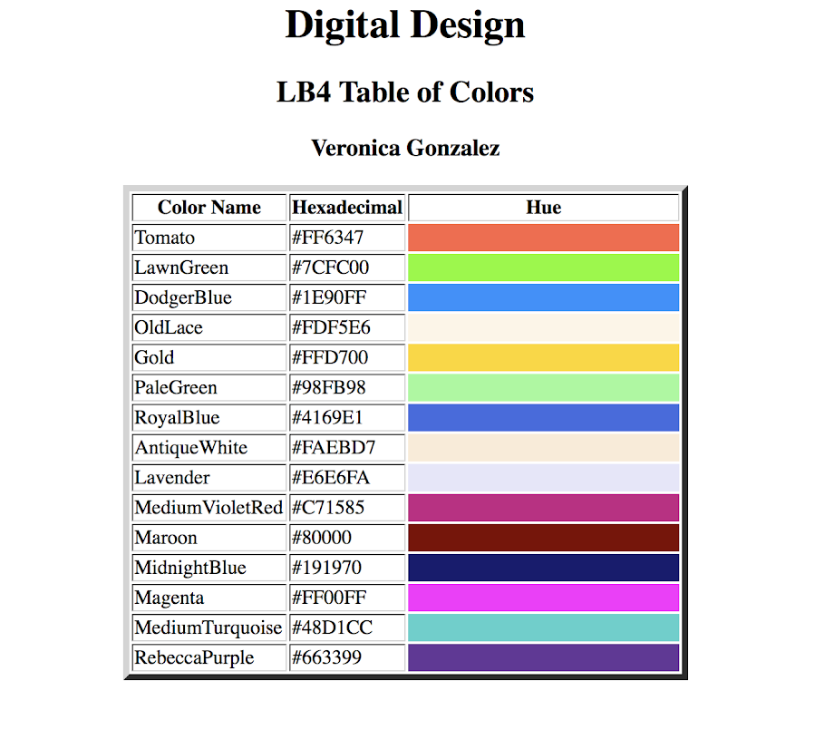
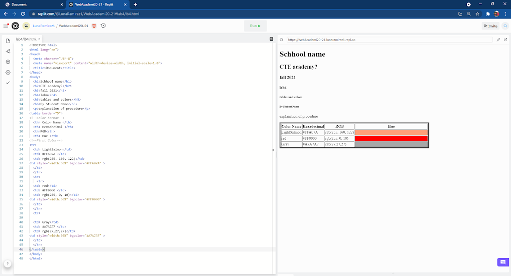

# Instructions  

 ## ** HTML table of colors **
 We learned how to create a table in our html code. We were not required to write paragraphs or insert images or hyperlinks into our html code. This time we were introduced to a new skill that would become useful for future labs. In this lab we learned how to make a table in html.  It make look easy but it can be quite confusing. First off you must know the tags that help create a table. These tags are <th>, <tr>, and <td>. The tag <th> is used to create a column, the tag <tr> is used to create a row, and the tag <td> is used to add information. A <td> tag contains data. For this lab, in order to build up our table skills to work, we had to create a table based on colors. We were allowed to pick a total of 15 colors. In this case we were asked to include the name of the color, the colors hexadecimal, RGB and to provide the colors hue. Since we were asked these four things, we had to create 4 columns in which I used the tag <th>. Each time we started a new color I had to use the tag <td> and then after this tag I would use the tag <td> to type in the colors information. Once I finished a row I would close it with </td> because it would allow the computer to understand that I finished the row ad will ow work with another row. We repeated this process until finished  including the information of all 15 colors in my table. **

  ## Steps
  1. Use you bas elab template to start this lab
  2. Find 15 unique color names and their hexadecimal and RGB values
  3. Use that to create a Table of colors like this example

  For example:

  
  
  
  
  
  